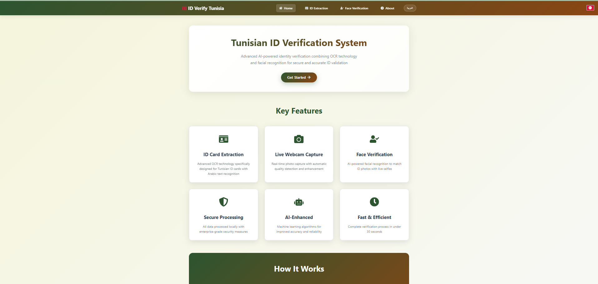
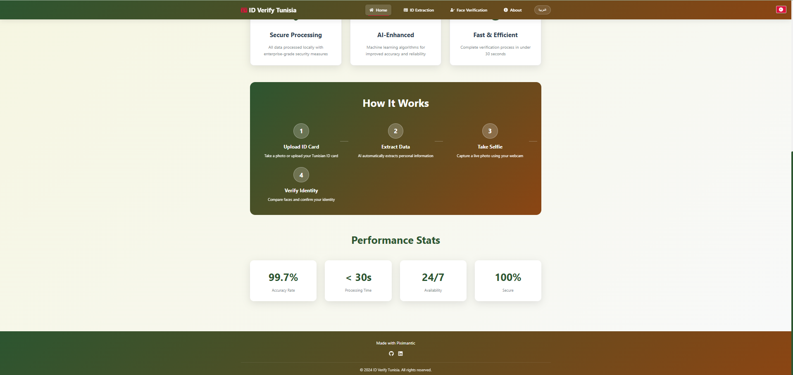
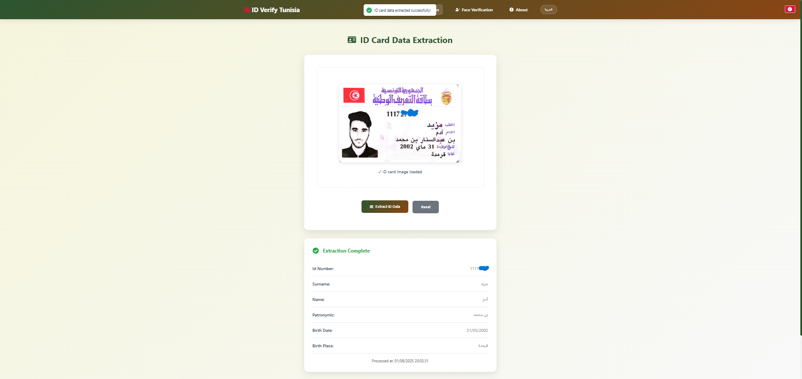
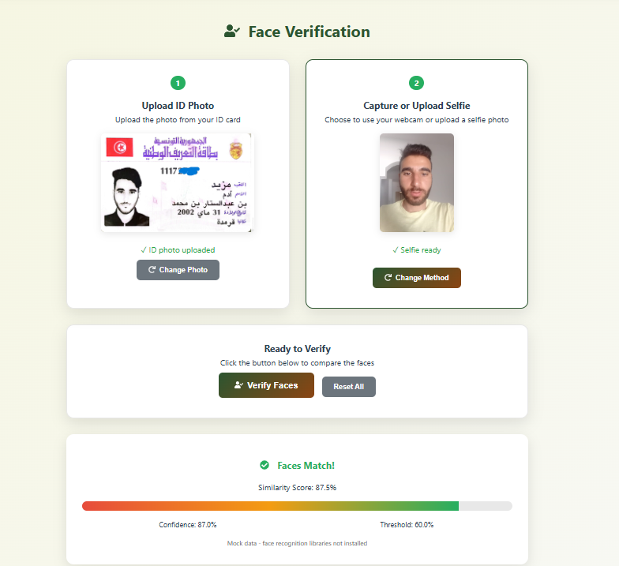

# 🔒 Pixemantic Internship Project — OCR & Biometric Verification System

**Status:** Confidential (No Source Code Shared)  
**Intern:** Adem — Summer Internship 2025  
**Organization:** Pixemantic  
**Period:** July – September 2025  

---

## 🧠 Project Overview

This project was completed during my summer internship at **Pixemantic**.  
It focuses on developing an **OCR-based data extraction and facial verification system** for **Tunisian ID cards**.

The main goal was to automatically:
- Extract structured text fields (name, CIN, date of birth, etc.)
- Verify the person’s identity using **face recognition**
- Provide a reliable and fast API to support ID validation

---

## ⚙️ Technologies Used

| Category | Stack |
|-----------|-------|
| Backend | FastAPI (Python) |
| OCR Engine | PaddleOCR, EasyOCR |
| Computer Vision | OpenCV |
| Frontend | React.js |
| Database | SQLite / PostgreSQL |
| Tools | Git, Docker, VSCode |

---

## 🖼️ Screenshots (Illustrative Only)

> All screenshots are non-confidential and anonymized for privacy.

### 🔹 Page d’Accueil (Home Page)

| Page d’Accueil 1 | Page d’Accueil 2 |
|------------------|------------------|
|  |  

### 🔹 OCR & Face Verification

| OCR Extraction | Face Verification |
|----------------|-------------------|
|  |  |

|

---

## 🧩 Key Features

- Automatic OCR extraction for Tunisian ID cards  
- Face verification using image similarity  
- Adaptive preprocessing for multiple ID formats  
- Full-stack architecture connecting React and FastAPI  

---

## 🧾 Internship Highlights

During this internship, I:
- Designed and implemented an OCR + face recognition system  
- Created an adaptive image-processing pipeline  
- Evaluated accuracy on a dataset of 30+ real ID samples  
- Wrote a full technical report with UML diagrams and architecture design  

---

## 🔐 Confidentiality Notice

This repository serves only as a **presentation** of the work completed during my internship at Pixemantic.  
All code, models, and data are **strictly confidential** and remain the property of **Pixemantic**.  
Only screenshots and public information are displayed here.

---

## 🏁 Outcome

✅ Functional prototype of a complete ID verification system  
✅ Integration of OCR + facial recognition pipeline  
✅ Improved OCR generalization across ID formats  
✅ Professional report and documentation delivered

---

> 📬 For inquiries or collaboration, please contact me via GitHub.
